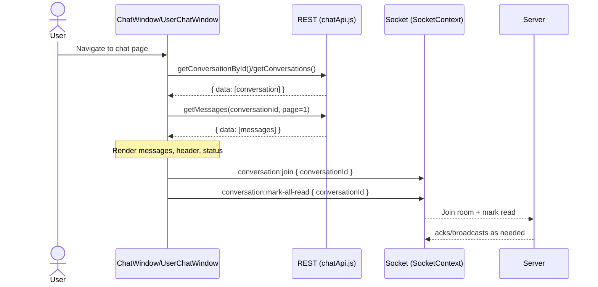
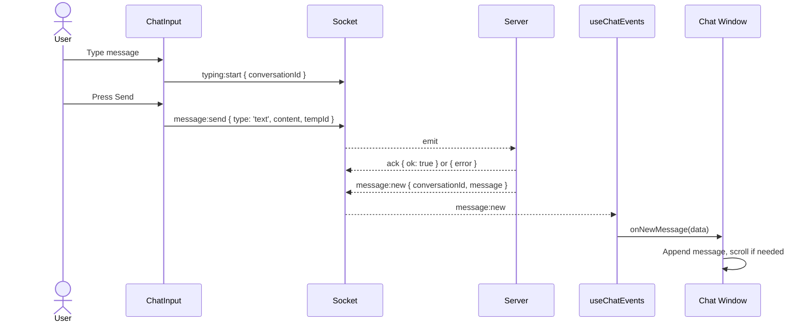
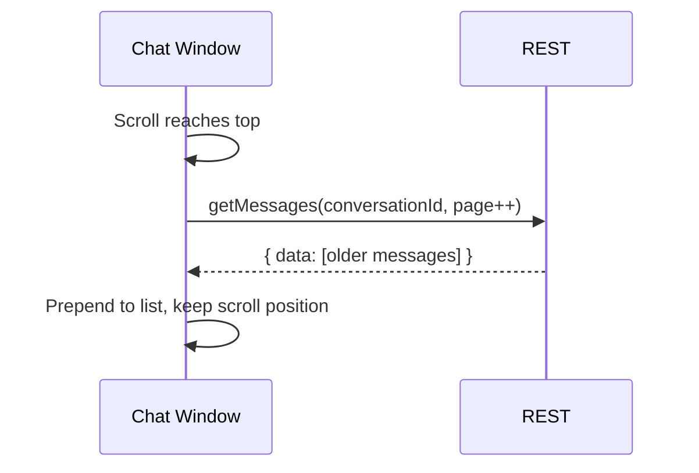
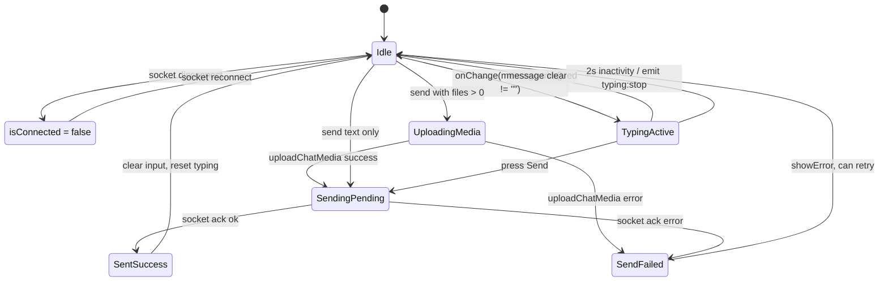
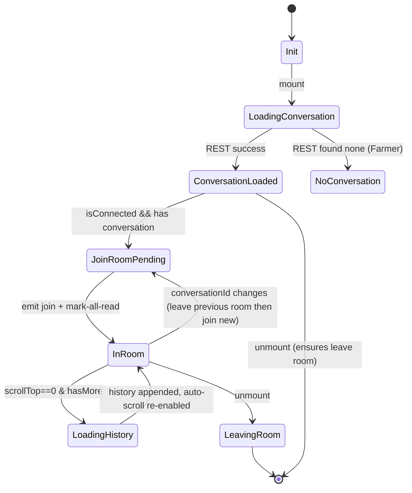
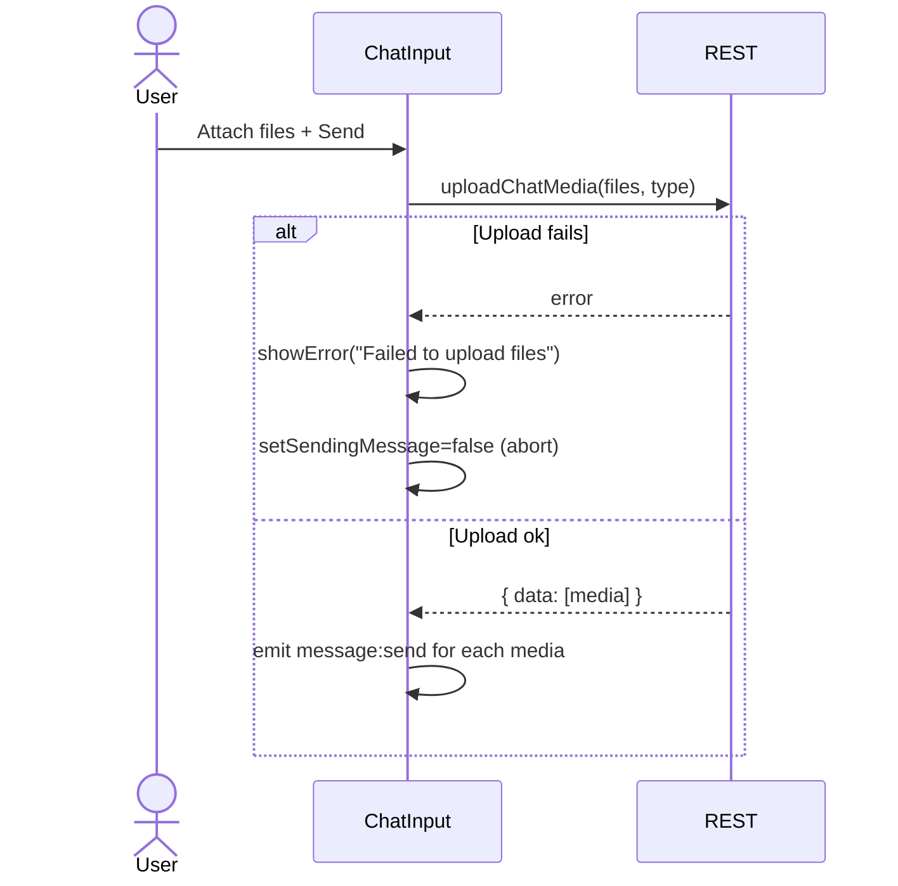
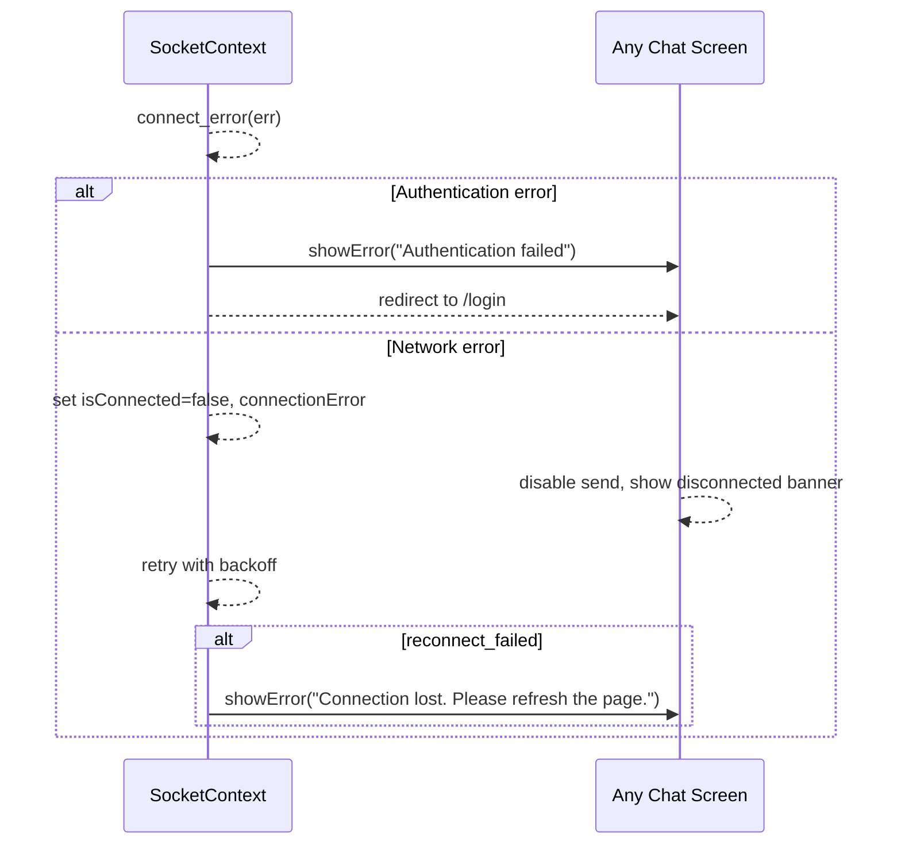

# Agritech Chat System – Architecture and Runtime Guide

This document explains how the in-app chat works end-to-end: API calls, Socket.IO events, component responsibilities, and data flow. It reflects the current implementation in this repo after recent fixes.

Contents

- High-level overview
- Data flow: fetching, rendering, updating
- Socket.IO: connection, emit/listen, reconnection
- Components walkthrough (Admin and Farmer experiences)
- API layer: endpoints used and when
- Event catalog: what we emit and what we listen to
- Edge cases and safeguards
- Sequence walkthroughs

---

## 1) High-level overview

- Real-time transport: Socket.IO client managed by `context/SocketContext.jsx`.
- Server API: REST endpoints via `lib/chatApi.js` for initial loads (conversations, messages, uploads, status updates).
- Event glue: `hooks/useChatEvents.js` registers all chat-related listeners once per mount and forwards them to screen-specific callbacks.
- UI:
  - Admin chat: `components/admin/support-chat/ChatWindow.jsx`
  - Farmer chat: `components/farmer/support/UserChatWindow.jsx`
  - Shared chat input: `components/chat/ChatInput.jsx`
  - Message rendering: `components/chat/MessageBubble.jsx`

General lifecycle

1) Page mounts → fetch conversation(s) + first page of messages via REST.
2) Once socket is connected and a conversation is present → join its room over socket and mark messages read.
3) Incoming socket events update UI reactively (new messages, typing, read-receipts, presence).
4) Outgoing actions (typing, send message) are emitted via socket; some actions (status update) go via REST.

---

## 2) Data flow

Initial fetch

- Admin chat (`ChatWindow`):
  - Conversation details via `getConversationById(conversationId)`.
  - Messages via `getMessages(conversationId, page=1, limit=50)`.
- Farmer chat (`UserChatWindow`):
  - Loads the first conversation via `getConversations(page=1, limit=1)` and takes index `0` if present.
  - Then `getMessages(conv._id, page=1, limit=50)`.

Pagination

- When the messages scroll reaches the top, we load older pages using `getMessages(conversationId, nextPage, limit)` and prepend them to the list.
- Auto-scroll is disabled during history fetch to avoid jumping the viewport, then re-enabled after a short delay.

Live updates

- `useChatEvents` subscribes once to socket events and calls the handlers passed in by the current chat window:
  - Append new messages to the list if they belong to the active conversation.
  - Toggle typing indicators.
  - Apply read receipts to individual messages.
  - Update user presence (online/offline, lastSeen).

---

## 3) Socket.IO management

File: `context/SocketContext.jsx`

Initialization

- Reads auth token from cookie `agritech_token`.
- Creates a single `socket` instance using `io(process.env.NEXT_PUBLIC_FILEURL || 'http://localhost:5000')` with `auth: { token }`.
- Tracks `isConnected` and `connectionError` and exposes helpers: `emit`, `on`, `off`, `disconnect`, `reconnect`.

Reconnection and errors

- Listens for `connect`, `disconnect`, `connect_error`, `reconnect`, `reconnect_error`, `reconnect_failed`.
- On auth errors, a toast is shown and the user is redirected to login.

Emitting and subscribing

- `emit(event, data, [ack])`: emits only if connected; safe-guards against emitting when socket is down.
- `on(event, cb)` / `off(event, cb)`: attach/detach listeners to the underlying socket instance.

Unmount cleanup

- On provider unmount, disconnects the socket and clears timers.

---

## 4) Event registration (useChatEvents)

File: `hooks/useChatEvents.js`

Purpose

- Centralizes all socket event listeners for chat and forwards them to (optional) handlers provided by the screen (Admin or Farmer chat windows).

Registered listeners

- [ ] `message:new` → new message payload
- [ ] `notification:new-message` → new message notification payload
- [ ] `typing:user-typing` → someone started typing
- [ ] `typing:user-stopped` → someone stopped typing
- [ ] `message:read-receipt` → a specific message was read
- [ ] `conversation:all-read` → the conversation has been marked fully read
- [ ] `user:online` / `user:offline` → presence updates
- [ ] `error` → general socket error channel

Notes

- The hook registers listeners once the socket is connected and cleans them up on unmount or handler change.
- Optional sounds/notifications are triggered when enabled.

---

## 5) Components walkthrough

### 5.1 Admin – Chat window

File: `components/admin/support-chat/ChatWindow.jsx`

Responsibilities

- Load conversation details and messages (page 1) via REST.
- Join the socket room for that conversation; mark all messages as read.
- Render messages, typing indicator, online status.
- Load older messages when scrolled to the top.
- Update conversation status (Open/Waiting/Resolved/Closed) via REST.

Key behaviors

- Room join/leave: Uses a `joinedRoomRef` to avoid double-joining and to ensure previous rooms are left when the conversation changes.
- Auto-scroll: Only scrolls on new messages if `shouldAutoScroll` is true; disabled temporarily while loading history.
- Message updates: On `message:new` for this conversation, append the message and update conversation’s `lastMessage` locally.
- Read receipts: On `message:read-receipt`, updates the specific message with `isRead` and `readAt`.
- Presence: On `user:online`/`user:offline`, updates `conversation.userId` presence (for the non-self participant shown in header).

Outgoing actions

- Join room: `emit('conversation:join', { conversationId })`
- Mark all read: `emit('conversation:mark-all-read', { conversationId })`
- Leave room: `emit('conversation:leave', { conversationId })` on unmount or change.
- Change status (REST): `updateConversationStatus(conversationId, newStatus)`.

### 5.2 Farmer – User chat window

File: `components/farmer/support/UserChatWindow.jsx`

Responsibilities

- Discover the single (or most recent) conversation via `getConversations(1, 1)`.
- Load initial page of messages for that conversation.
- Join the socket room and mark all as read.
- Render messages, typing indicator, and the support agent’s presence.

Behaviors mirror the Admin window with the participant flipped to `assignedSupportId`.

### 5.3 Shared – Chat input

File: `components/chat/ChatInput.jsx`

Responsibilities

- Compose text, attach media files, and send messages via socket.
- Emit typing start/stop while the user is composing.
- Upload media via REST before emitting media messages.

Typing flow

- On first non-empty keystroke, emit `typing:start` once; throttle/stabilize using a short timeout and `lastEmittedTypingRef`.
- If no input changes for ~2s or the input is cleared, emit `typing:stop`.
- On unmount, ensure any outstanding typing state is stopped.

Sending messages

1) If files are attached:
   - Upload them via `uploadChatMedia(files, type)` REST API.
   - For each uploaded asset, emit `message:send` with `{ conversationId, messageType: media.type, mediaId, tempId }`.
   - If text is also present, emit an additional `message:send` with `{ messageType: 'text', content }`.
2) If only text:
   - Emit `message:send` with `{ messageType: 'text', content }`.

Acknowledgments

- All `message:send` emits pass an ack callback; if the server replies with `{ error }`, we toast/log the failure.

Safeguards

- `sendingMessage` prevents rapid duplicate sends.
- Disallows sending while disconnected or while files are uploading.

---

## 6) API layer

File: `lib/chatApi.js`

Conversations

- `createOrGetConversation()` → `POST /chat/conversations`
- `getConversations(page, limit, status)` → `GET /chat/conversations?{page,limit,status?}`
- `getConversationById(id)` → `GET /chat/conversations/:id`
- `updateConversationStatus(id, status)` → `PATCH /chat/conversations/:id/status` with body `{ status }`
- `deleteConversation(id)` → `DELETE /chat/conversations/:id`

Messages

- `getMessages(conversationId, page, limit)` → `GET /chat/messages/:conversationId?{page,limit}`
- `markMessageAsRead(messageId)` → `PATCH /chat/messages/:messageId/read`
- `markConversationAsRead(conversationId)` → `PATCH /chat/conversations/:conversationId/read`
- `deleteMessage(messageId)` → `DELETE /chat/messages/:messageId`

Support/Admin

- `getAllConversationsForSupport(page, limit, status, assignedTo)` → `GET /chat/support/conversations`
- `reassignConversation(conversationId, newSupportId)` → `POST /chat/support/reassign`
- `getConversationStats()` → `GET /chat/support/stats`

Media upload

- `uploadChatMedia(files, type)` → `POST /chat/media` with `multipart/form-data` including array `media` and `type` (`image|video|audio`).

Utilities

- `getCurrentUser()` reads `agritech_user` cookie for id/role.

---

## 7) Event catalog

Emitted (client → server)

- `conversation:join` → `{ conversationId }`
- `conversation:leave` → `{ conversationId }`
- `conversation:mark-all-read` → `{ conversationId }`
- `typing:start` → `{ conversationId }`
- `typing:stop` → `{ conversationId }`
- `message:send` →
  - Text: `{ conversationId, messageType: 'text', content, tempId }`
  - Media: `{ conversationId, messageType: 'image'|'video'|'audio', mediaId, tempId }`
  - Ack callback: `(response) => { if (response?.error) /* notify */ }`

Listened (server → client)

- `message:new` → `{ conversationId, message, sender? }`
  - Used to append to the open conversation and refresh lastMessage.
- `notification:new-message` → `{ conversationId, message, sender? }`
  - Triggers sound/notification (when enabled).
- `typing:user-typing` → `{ conversationId, userName }`
- `typing:user-stopped` → `{ conversationId, userName }`
- `message:read-receipt` → `{ conversationId, messageId, readAt }`
- `conversation:all-read` → `{ conversationId, readAt }`
- `user:online` → `{ userId }`
- `user:offline` → `{ userId, lastSeen }`
- `error` → generic error payload for socket errors.

Notes

- Payload shapes above reflect what the UI consumes; the server may include more fields that are currently unused by the client.

---

## 8) Edge cases and safeguards

- Socket not ready: `emit` is a no-op with a warning; UI disables send while disconnected.
- Room tracking: `joinedRoomRef` ensures we do not double-join and that we leave previous rooms on conversation change or unmount.
- Auto-scroll control: disabled during history loads to prevent scroll jumps, then re-enabled.
- Typing noise: only a single `typing:start` is emitted while the user is actively typing; `typing:stop` fires after inactivity or input clear.
- Duplicate sends: blocked by `sendingMessage` flag.
- Auth failures: on socket auth error, user is notified and redirected to login.

---

## 9) Sequence walkthroughs

Send text message

1) User types → `typing:start` (once), then `typing:stop` after 2s idle.
2) User hits send:
   - Socket emit: `message:send { messageType: 'text', content }` with ack.
   - On ack error → show toast; otherwise server will broadcast `message:new` back.
3) Listener `message:new` updates the message list (and conversation preview) if `conversationId` matches the open room.

Send media message

1) Attach files → `uploadChatMedia(files, type)`.
2) For each uploaded item → `message:send { messageType: type, mediaId }` + optional text message.
3) Same `message:new` flow as text.

Open conversation

1) REST: fetch conversation + page-1 messages.
2) Socket: `conversation:join`, then `conversation:mark-all-read`.
3) Listeners provide live updates.

---

## 10) Key files reference

- Socket provider: `context/SocketContext.jsx`
- Event hub: `hooks/useChatEvents.js`
- Admin window: `components/admin/support-chat/ChatWindow.jsx`
- Farmer window: `components/farmer/support/UserChatWindow.jsx`
- Input: `components/chat/ChatInput.jsx`
- Message: `components/chat/MessageBubble.jsx`
- APIs: `lib/chatApi.js`
- Utils: `lib/chatUtils.js`

---

If you need deeper details (e.g., exact message object structure), we can extend this document with sample payloads captured from the server, or instrument the client to log payloads during development.

---

## 11) Diagrams

### 11.1 Open conversation



### 11.2 Send text message



### 11.3 Load older messages (pagination)



---

## 12) Sample payloads (representative)

Note: The client expects a wrapper `{ data: ... }` from REST calls.

### 12.1 getConversations (REST)

```json
{
  "data": [
    {
      "_id": "679a1c...",
      "userId": {
        "_id": "u123",
        "first_name": "Asha",
        "last_name": "Patel",
        "phone": "+911234567890",
        "image": "/uploads/users/u123.jpg",
        "isOnline": true,
        "lastSeen": "2025-11-06T05:30:00.000Z"
      },
      "assignedSupportId": {
        "_id": "s456",
        "first_name": "Ravi",
        "last_name": "Sharma",
        "image": "/uploads/users/s456.jpg",
        "isOnline": false,
        "lastSeen": "2025-11-06T04:59:00.000Z"
      },
      "status": "open",
      "lastMessage": {
        "_id": "m890",
        "messageType": "text",
        "content": "Hello!",
        "createdAt": "2025-11-06T05:29:58.000Z"
      },
      "updatedAt": "2025-11-06T05:29:59.000Z"
    }
  ]
}
```

### 12.2 getMessages (REST)

```json
{
  "data": [
    {
      "_id": "m001",
      "conversationId": "679a1c...",
      "senderId": { "_id": "u123", "first_name": "Asha", "last_name": "Patel" },
      "messageType": "text",
      "content": "Hi, I need help",
      "media": null,
      "isRead": true,
      "readAt": "2025-11-06T05:30:05.000Z",
      "createdAt": "2025-11-06T05:30:00.000Z"
    },
    {
      "_id": "m002",
      "conversationId": "679a1c...",
      "senderId": { "_id": "s456", "first_name": "Ravi", "last_name": "Sharma" },
      "messageType": "image",
      "content": null,
      "media": { "_id": "med123", "type": "image", "url": "/chat/media/med123.jpg", "width": 1280, "height": 720 },
      "isRead": false,
      "readAt": null,
      "createdAt": "2025-11-06T05:31:00.000Z"
    }
  ]
}
```

### 12.3 uploadChatMedia (REST)

```json
{
  "data": [
    { "_id": "med123", "url": "/chat/media/med123.jpg", "type": "image", "size": 245678, "width": 1280, "height": 720 },
    { "_id": "med124", "url": "/chat/media/med124.jpg", "type": "image", "size": 198765, "width": 1024, "height": 768 }
  ]
}
```

### 12.4 Socket emits (client → server)

- conversation:join

```json
{ "conversationId": "679a1c..." }
```

- typing:start / typing:stop

```json
{ "conversationId": "679a1c..." }
```

- message:send (text)

```json
{ "conversationId": "679a1c...", "messageType": "text", "content": "Hello", "tempId": "tmp_abc123" }
```

- message:send (media)

```json
{ "conversationId": "679a1c...", "messageType": "image", "mediaId": "med123", "tempId": "tmp_def456" }
```

- Typical ack

```json
{ "ok": true, "messageId": "m999" }
```

-or-

```json
{ "error": "Validation failed" }
```

### 12.5 Socket events (server → client)

- message:new

```json
{
  "conversationId": "679a1c...",
  "message": {
    "_id": "m999",
    "senderId": { "_id": "s456", "first_name": "Ravi", "last_name": "Sharma" },
    "messageType": "text",
    "content": "Thanks for contacting us!",
    "createdAt": "2025-11-06T05:33:00.000Z",
    "isRead": false,
    "readAt": null
  },
  "sender": { "_id": "s456", "name": "Ravi Sharma" }
}
```

- typing:user-typing

```json
{ "conversationId": "679a1c...", "userName": "Ravi Sharma" }
```

- typing:user-stopped

```json
{ "conversationId": "679a1c...", "userName": "Ravi Sharma" }
```

- message:read-receipt

```json
{ "conversationId": "679a1c...", "messageId": "m999", "readAt": "2025-11-06T05:34:00.000Z" }
```

- conversation:all-read

```json
{ "conversationId": "679a1c...", "readAt": "2025-11-06T05:34:10.000Z" }
```

- user:online

```json
{ "userId": "s456" }
```

- user:offline

```json
{ "userId": "s456", "lastSeen": "2025-11-06T05:40:00.000Z" }
```

---

## 13) Capturing live payloads (optional)

- Browser devtools → Network → WS → select the socket connection to see frames in real time.
- The code already logs key events in `useChatEvents` (e.g., `console.log('New message received:', data)`), so open the Console to inspect.
- To increase Socket.IO client debug logs, you can set `localStorage.debug = 'socket.io-client*'` in the devtools console before loading the page.

---

## 14) Component state charts

### 14.1 ChatInput state machine



Notes

- `lastEmittedTypingRef` ensures `typing:start` is emitted only once per active typing session; a 2s timer emits `typing:stop`.
- `sendingMessage` prevents duplicate sends while awaiting ack.
- `isConnected` gates all emits; UI disables send when false.

### 14.2 ChatWindow/UserChatWindow state machine



Notes

- `joinedRoomRef` tracks the active room; on change/unmount, we emit `conversation:leave` for the previous room.
- Auto-scroll is disabled only during history fetch to preserve viewport.

---

## 15) Annotated error paths

### 15.1 Send text with ack error

```mermaid
sequenceDiagram
    actor User
    participant Input as ChatInput
    participant Sock as Socket
    participant S as Server
    participant Page as Chat Window

    User->>Input: Press Send
    Input->>Sock: message:send { text, tempId } with ack
    Sock-->>S: emit
    alt Server rejects
      S-->>Sock: ack { error: "Validation failed" }
      Sock-->>Input: ack error callback
      Input->>Input: showError, setSendingMessage=false
      Note over Page: No optimistic append; waits for message:new
    else Server accepts
      S-->>Sock: ack { ok: true, messageId }
      S-->>Sock: message:new { conversationId, message }
    end
```

### 15.2 Media upload failure



### 15.3 Socket connect_error / reconnect_failed


